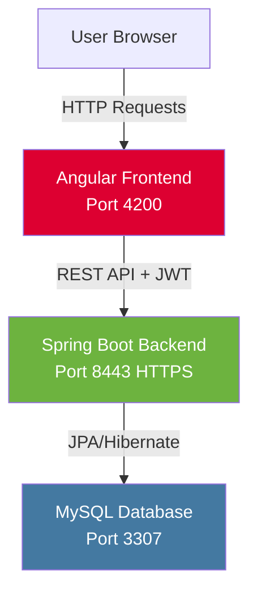
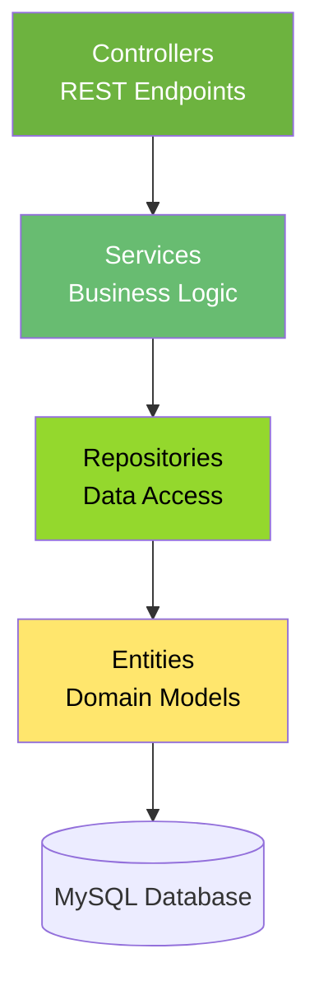
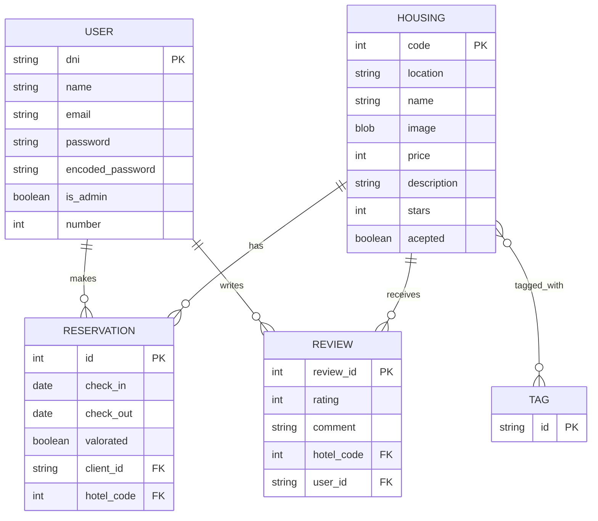
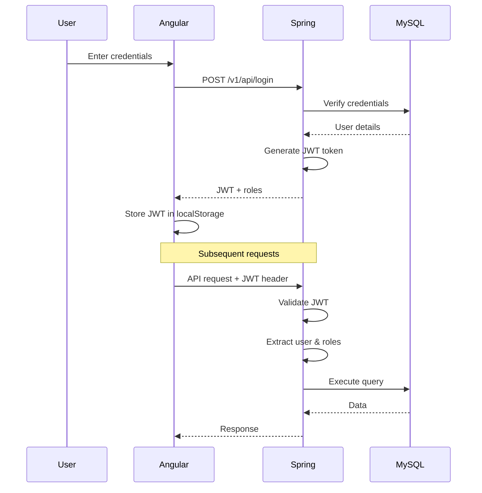

Trippins follows a modern three-tier architecture with a clear separation between the presentation layer (Angular frontend), business logic layer (Spring Boot backend), and data layer (MySQL database).

## High-Level Overview



<Note>
  The frontend and backend communicate via RESTful APIs secured with JWT (JSON Web Tokens). All API endpoints are documented using OpenAPI/Swagger.
</Note>

## Backend Architecture

The Spring Boot backend follows a layered architecture pattern with clear separation of concerns.

### Layer Structure



### Controllers

Controllers handle HTTP requests and define REST API endpoints. Each controller is mapped to a specific resource.

**Example: HousingRestController**

```java HousingRestController.java
@RestController
@RequestMapping("/v1/api/houses")
@Tag(name = "Housing Management", description = "APIs for managing houses and their tags")
public class HousingRestController {

    @Autowired
    HousingService housingService;

    @GetMapping
    public ResponseEntity<List<HousingDTO>> getAllhouses() {
        List<HousingDTO> houses = housingService.getAllHouses();
        return ResponseEntity.ok(houses);
    }

    @GetMapping("/{id}")
    public ResponseEntity<HousingDTO> getHouseById(@PathVariable Integer id) {
        HousingDTO house = housingService.getHouseById(id);
        return ResponseEntity.ok(house);
    }
}
```

**Key Controllers:**

| Controller | Path | Purpose |
|------------|------|---------|
| `HousingRestController` | `/v1/api/houses` | Manage hotels/housing listings |
| `ReservationRestController` | `/v1/api/reservations` | Handle booking operations |
| `UserRestController` | `/v1/api/users` | User management (admin only) |
| `ReviewRestController` | `/v1/api/reviews` | Manage hotel reviews |
| `AuthenticationRestController` | `/v1/api/login` | JWT authentication |

### Services

Services contain business logic and orchestrate operations between controllers and repositories.

**Example: HousingService**

```java HousingService.java
@Service
public class HousingService {

    @Autowired
    private HousingRepository housingRepository;

    @Autowired
    private TagRepository tagRepository;

    public List<HousingDTO> getAllHouses() {
        List<Housing> houses = housingRepository.findAll();
        List<HousingDTO> housesDTOs = new ArrayList<>();
        for (Housing house : houses) {
            housesDTOs.add(new HousingDTO(house));
        }
        return housesDTOs;
    }

    public HousingDTO getHouseById(Integer id) {
        Optional<Housing> house = housingRepository.findById(id);
        return new HousingDTO(house.get());
    }
}
```

**Key Services:**

- `HousingService` - Hotel CRUD operations, tag management, image handling
- `ReservationService` - Booking logic, availability checks, email confirmations
- `UserService` - User registration, profile management
- `ReviewService` - Review submission and retrieval
- `EmailService` - Automated email notifications using SMTP
- `RepositoryUserDetailsService` - User authentication for Spring Security

### Repositories

Repositories provide data access using Spring Data JPA. They extend `JpaRepository` for automatic CRUD operations.

**Example: HousingRepository**

```java HousingRepository.java
@Repository
public interface HousingRepository extends JpaRepository<Housing, Integer> {
    
    @Query("SELECT MAX(code) FROM Housing")
    Integer maxhotelCode();

    Page<Housing> findByAceptedFalse(Pageable pageable);
    Page<Housing> findByAceptedTrue(Pageable pageable);
    Optional<Housing> findByCode(Integer code);
    
    List<Housing> findByStarsGreaterThanEqual(Integer stars);

    // Advanced search with tags
    @Query("SELECT h FROM Housing h " +
           "JOIN h.tags t " +
           "WHERE t.id IN :tagNames AND h.stars >= :stars " +
           "GROUP BY h.code " +
           "HAVING COUNT(DISTINCT t.id) = :tagCount")
    List<Housing> findByTagsAndStars(@Param("tagNames") Set<String> tagNames,
                                    @Param("stars") Integer stars,
                                    @Param("tagCount") Long tagCount);
}
```

**Key Repositories:**

- `HousingRepository` - Housing/hotel queries
- `ReservationRepository` - Reservation queries
- `UserRepository` - User lookups by email, DNI, name
- `ReviewRepository` - Review queries
- `TagRepository` - Tag management

### Entities

Entities represent database tables using JPA annotations. They define the domain model.

**Example: User Entity**

```java User.java
@Entity
@Table(name = "User")
public class User {
    @Id
    @Column(name = "dni", nullable = false, unique = true, length = 9)
    private String dni;

    @Column(name = "name", nullable = false, unique = true, length = 100)
    private String name;

    @Column(name = "email", nullable = false, unique = true, length = 40)
    private String email;

    @Column(name = "password", nullable = false, length = 20)
    private String password;

    @Column(name = "is_admin", nullable = false)
    protected Boolean admin;

    @ElementCollection(fetch = FetchType.EAGER)
    private List<String> roles;

    @Column(name = "encoded_password", nullable = true)
    private String encodedPassword;
    
    // Getters and setters...
}
```

**Example: Housing Entity**

```java Housing.java
@Entity
public class Housing {
    @Id
    @GeneratedValue(strategy = GenerationType.IDENTITY)
    private int code;

    @Column(name = "location", nullable = false)
    private String location;

    @Column(name = "name", nullable = false, unique = true, length = 100)
    private String name;

    @Lob
    @Column(name = "image", columnDefinition = "LONGBLOB")
    @JsonIgnore
    private Blob image;

    @Column(name = "price", nullable = false)
    private Integer price;

    @Column(name = "stars", nullable = false)
    private Integer stars;

    @Column(name = "acepted", nullable = false)
    protected Boolean acepted;

    @ManyToMany
    @JoinTable(
        name = "housing_tags",
        joinColumns = @JoinColumn(name = "housing_id"),
        inverseJoinColumns = @JoinColumn(name = "tag_id")
    )
    private Set<Tag> tags;
    
    // Getters, setters, and methods...
}
```

**Example: Reservation Entity**

```java Reservation.java
@Entity
public class Reservation {
    @Id
    @GeneratedValue(strategy = GenerationType.IDENTITY)
    private Integer id;

    @Column(name = "check_in", nullable = false)
    private Date check_in;

    @Column(name = "check_out", nullable = false)
    private Date check_out;

    @Column(name="valorated")
    private boolean valorated;

    @ManyToOne
    @JoinColumn(name = "Client_ID", referencedColumnName = "dni", nullable = false)
    private User client;

    @ManyToOne
    @JoinColumn(name = "Hotel_Code", referencedColumnName = "code", nullable = false)
    private Housing housing;
    
    // Getters and setters...
}
```

## Database Schema

The database uses MySQL 8.0.33 with the following core tables:



### Key Relationships

- **User → Reservation**: One-to-Many (a user can make multiple reservations)
- **User → Review**: One-to-Many (a user can write multiple reviews)
- **Housing → Reservation**: One-to-Many (a hotel can have multiple reservations)
- **Housing → Review**: One-to-Many (a hotel can have multiple reviews)
- **Housing ↔ Tag**: Many-to-Many (hotels can have multiple tags, tags apply to multiple hotels)

## Frontend Architecture

The Angular frontend is organized into a modular component-based structure.

### Directory Structure

```
frontend/src/app/
├── components/          # UI Components
│   ├── header/         # Navigation header
│   ├── footer/         # Footer component
│   ├── index/          # Home page
│   ├── login/          # Login form
│   ├── register/       # Registration form
│   ├── room/           # Hotel listing
│   ├── room-details/   # Hotel detail view
│   ├── profile/        # User profile
│   ├── admin/          # Admin panel
│   │   ├── housing-panel/      # Housing management
│   │   └── reservation-panel/  # Reservation management
│   └── testimonials/   # Reviews section
├── services/           # API Services
│   ├── auth.service.ts         # Authentication
│   ├── housing-service.service.ts
│   ├── reservation-service.service.ts
│   ├── user-service.service.ts
│   └── review-service.service.ts
├── guards/             # Route Guards
│   ├── auth.guard.ts   # Authentication guard
│   └── role.guard.ts   # Role-based guard
├── interceptors/       # HTTP Interceptors
│   └── auth.interceptor.ts  # JWT token injection
├── models/             # TypeScript Models
│   └── DTOS/          # Data Transfer Objects
└── shared/            # Shared utilities
```

### Services

Services handle API communication and state management.

**Example: AuthService**

```typescript auth.service.ts
@Injectable({
  providedIn: 'root'
})
export class AuthService {
  private readonly JWT_KEY = 'auth_jwt';
  private readonly ROLES_KEY = 'user_roles';

  constructor(private http: HttpClient) {}

  login(credentials: { email: string; password: string }): Observable<AuthenticationResponse> {
    return this.http.post<AuthenticationResponse>(`${environment.baseUrlApi}/login`, credentials).pipe(
      tap(response => {
        this.storeJwt(response.jwt);
        this.storeRoles(response.roles);
      })
    );
  }

  private storeJwt(jwt: string): void {
    localStorage.setItem(this.JWT_KEY, jwt);
  }

  getJwt(): string | null {
    return localStorage.getItem(this.JWT_KEY);
  }

  isLoggedIn(): boolean {
    return !!this.getJwt();
  }

  logout(): void {
    localStorage.removeItem(this.JWT_KEY);
    localStorage.removeItem(this.ROLES_KEY);
  }
}
```

### Guards

Guards protect routes based on authentication and authorization.

**Auth Guard**: Ensures user is logged in
**Role Guard**: Ensures user has specific roles (e.g., ADMIN)

### Interceptors

The HTTP interceptor automatically adds JWT tokens to all API requests.

**Example: AuthInterceptor**

```typescript auth.interceptor.ts
@Injectable()
export class AuthInterceptor implements HttpInterceptor {
  constructor(private authService: AuthService) {}

  intercept(request: HttpRequest<any>, next: HttpHandler): Observable<HttpEvent<any>> {
    const token = this.authService.getJwt();
    if (token) {
      request = request.clone({
        setHeaders: {
          Authorization: `Bearer ${token}`
        }
      });
    }
    return next.handle(request);
  }
}
```

## Authentication Flow

Trippins uses JWT (JSON Web Tokens) for stateless authentication.



### JWT Token Generation

The backend generates JWT tokens using the `JwtUtil` service:

```java JwtUtil.java
@Component
public class JwtUtil {
    private final Key SECRET_KEY = Keys.secretKeyFor(SignatureAlgorithm.HS256);

    public String generateToken(UserDetails userDetails) {
        Map<String, Object> claims = new HashMap<>();
        claims.put("roles", userDetails.getAuthorities().stream()
                .map(GrantedAuthority::getAuthority)
                .collect(Collectors.toList()));
        return createToken(claims, userDetails.getUsername());
    }

    private String createToken(Map<String, Object> claims, String subject) {
        return Jwts.builder()
                .setClaims(claims)
                .setSubject(subject)
                .setIssuedAt(new Date(System.currentTimeMillis()))
                .setExpiration(new Date(System.currentTimeMillis() + 1000 * 60 * 60 * 10)) // 10 hours
                .signWith(SECRET_KEY, SignatureAlgorithm.HS256)
                .compact();
    }

    public Boolean validateToken(String token, UserDetails userDetails) {
        final String username = extractUsername(token);
        return (username.equals(userDetails.getUsername()) && !isTokenExpired(token));
    }
}
```

### Security Configuration

Spring Security is configured to:
- Allow public access to login, registration, and public pages
- Require authentication for user-specific pages
- Require ADMIN role for admin endpoints
- Use JWT filter for token validation

```java SecurityConfiguration.java
@Bean
public SecurityFilterChain securityFilterChain(HttpSecurity http) throws Exception {
    http
        .authorizeHttpRequests(auth -> auth
            .requestMatchers("/", "/index", "/register", "/v1/api/login/**").permitAll()
            .requestMatchers("/room", "/v1/api/query").permitAll()
            .requestMatchers("/v1/api/users/**", "/v1/api/admin/**").hasRole("ADMIN")
            .requestMatchers("/admin/**").hasRole("ADMIN")
            .anyRequest().authenticated()
        )
        .sessionManagement(session -> session
            .sessionCreationPolicy(SessionCreationPolicy.STATELESS)
        )
        .addFilterBefore(jwtRequestFilter, UsernamePasswordAuthenticationFilter.class)
        .csrf(csrf -> csrf.disable());

    return http.build();
}
```

## API Communication

The frontend communicates with the backend through RESTful API endpoints.

### Request Flow Example

**Creating a Reservation:**

1. User fills out reservation form in Angular
2. Angular service sends POST request to `/v1/api/reservations`
3. JWT interceptor adds `Authorization: Bearer <token>` header
4. Spring Security validates token
5. Controller receives request and calls service
6. Service validates business logic and saves to database
7. Email service sends confirmation email
8. Response returns to Angular
9. Angular displays success message using SweetAlert2

### Error Handling

Both frontend and backend implement comprehensive error handling:

**Backend**: Uses `@ExceptionHandler` and returns appropriate HTTP status codes
**Frontend**: Services catch errors and display user-friendly messages

## Email Notifications

The application sends automated emails for:
- Reservation confirmations
- Booking status updates

Email configuration in `application.properties`:

```properties
spring.mail.host=smtp.gmail.com
spring.mail.port=587
spring.mail.username=trippins.urjc@gmail.com
spring.mail.properties.mail.smtp.auth=true
spring.mail.properties.mail.smtp.starttls.enable=true
```

## Image Handling

Hotel images are stored as BLOBs in the database and converted to Base64 for API transmission:

```java
public String getImageBase64() {
    if (image == null) {
        return "";
    }
    try {
        byte[] imageBytes = image.getBytes(1, (int) image.length());
        return Base64.getEncoder().encodeToString(imageBytes);
    } catch (SQLException e) {
        e.printStackTrace();
        return "";
    }
}
```

## Deployment Architecture

The application can be deployed using Docker Compose:

```yaml docker-compose.yml
version: '3.9'

services:
  db:
    image: mysql:8.0.33
    environment:
      - MYSQL_DATABASE=Trippins
      - MYSQL_ROOT_PASSWORD=password
    ports:
      - "3307:3306"

  web:
    build:
      context: ..
      dockerfile: docker/Dockerfile
    image: jantoniio3/trippins:latest
    ports:
      - "443:8443"
    depends_on:
      - db
    environment:
      - SPRING_DATASOURCE_URL=jdbc:mysql://db:3306/Trippins
      - SPRING_DATASOURCE_USERNAME=root
      - SPRING_DATASOURCE_PASSWORD=password
```

This creates:
- MySQL container on port 3307
- Application container with both frontend and backend on HTTPS port 443
- Shared network for container communication

## Technology Stack Summary

### Backend
- **Framework**: Spring Boot 3.4.3
- **Language**: Java 17
- **Security**: Spring Security with JWT
- **ORM**: Hibernate/JPA
- **API Documentation**: SpringDoc OpenAPI (Swagger)
- **Email**: Spring Mail with SMTP
- **Build Tool**: Maven

### Frontend
- **Framework**: Angular 17
- **Language**: TypeScript 5.2
- **Styling**: Bootstrap 5.3.5
- **Icons**: Font Awesome, Bootstrap Icons
- **HTTP Client**: Angular HttpClient
- **Notifications**: SweetAlert2
- **Build Tool**: Angular CLI

### Database
- **RDBMS**: MySQL 8.0.33
- **ORM**: Hibernate with JPA annotations

### Infrastructure
- **Containerization**: Docker
- **Orchestration**: Docker Compose
- **Web Server**: Embedded Tomcat (Spring Boot)
- **SSL**: Self-signed certificate (keystore.jks)
