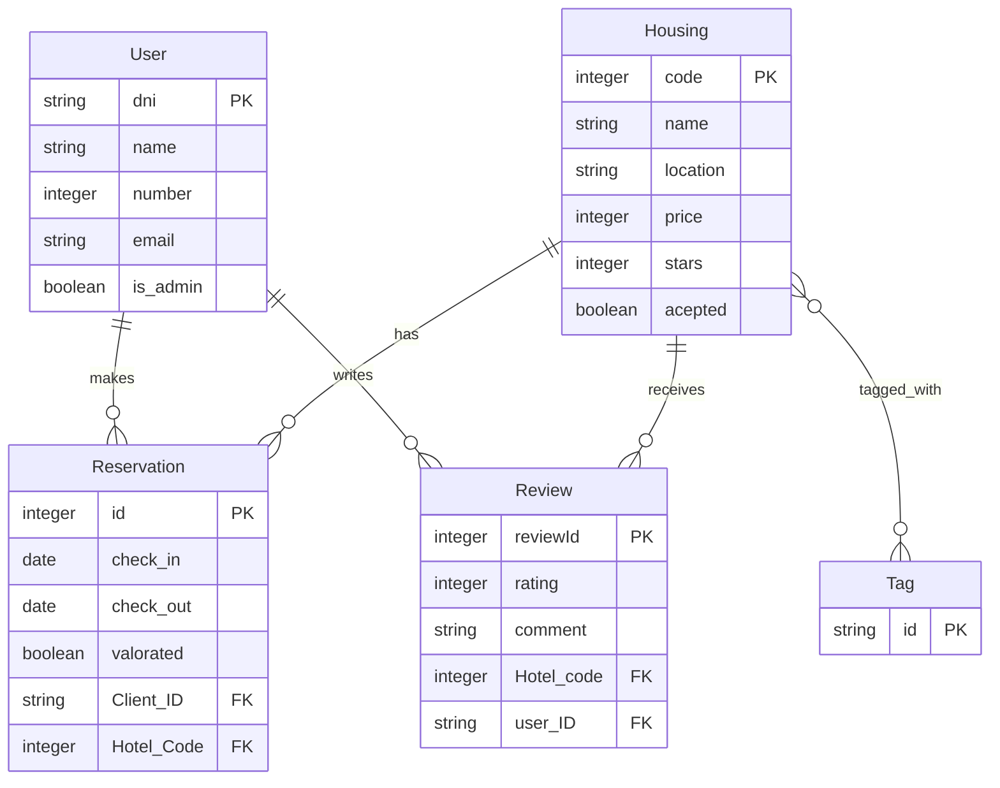

## Overview

Trippins uses MySQL 8.0.33 as its primary database with JPA/Hibernate for object-relational mapping. The database schema is automatically generated from entity classes.

<Info>
  The database schema is managed by Hibernate with the `update` strategy, which automatically creates and updates tables based on entity definitions.
</Info>

## Database Configuration

### MySQL Setup

<Tabs>
  <Tab title="Docker">
    MySQL is automatically configured in the Docker Compose setup:
    
    ```yaml
    db:
      image: mysql:8.0.33
      container_name: trippins-db
      restart: always
      environment:
        - MYSQL_DATABASE=Trippins
        - MYSQL_ROOT_PASSWORD=password
      ports:
        - "3307:3306"
      volumes:
        - db_data:/var/lib/mysql
    ```
    
    Access the database:
    ```bash
    docker exec -it trippins-db mysql -uroot -ppassword Trippins
    ```
  </Tab>
  
  <Tab title="Local">
    Install MySQL 8.0 and create the database:
    
    ```sql
    CREATE DATABASE Trippins;
    CREATE USER 'trippins'@'localhost' IDENTIFIED BY 'password';
    GRANT ALL PRIVILEGES ON Trippins.* TO 'trippins'@'localhost';
    FLUSH PRIVILEGES;
    ```
    
    Configure `application.properties`:
    ```properties
    spring.datasource.url=jdbc:mysql://localhost:3307/Trippins
    spring.datasource.username=root
    spring.datasource.password=1234
    ```
  </Tab>
</Tabs>

## Entity Model

The database schema consists of the following core entities:

<CardGroup cols={2}>
  <Card title="User" icon="user">
    User accounts with authentication and authorization
  </Card>
  <Card title="Housing" icon="house">
    Hotel and accommodation listings
  </Card>
  <Card title="Reservation" icon="calendar-check">
    Booking records for accommodations
  </Card>
  <Card title="Review" icon="star">
    User reviews and ratings for accommodations
  </Card>
  <Card title="Tag" icon="tag">
    Categories and features for accommodations
  </Card>
</CardGroup>

## Entity Definitions

### User Entity

Base entity for all user types (Client and Admin):

```java
@Entity
@Table(name = "User")
public class User {
    @Id
    @Column(name = "dni", nullable = false, unique = true, length = 9)
    private String dni;

    @Column(name = "name", nullable = false, unique = true, length = 100)
    private String name;

    @Column(name = "number", nullable = false, unique = true, length = 9)
    private Integer number;

    @Column(name = "password", nullable = false, length = 20)
    private String password;

    @Column(name = "email", nullable = false, unique = true, length = 40)
    private String email;

    @Column(name = "is_admin", nullable = false)
    protected Boolean admin;

    @ElementCollection(fetch = FetchType.EAGER)
    private List<String> roles;

    @Column(name = "encoded_password", nullable = true)
    private String encodedPassword;
}
```

<AccordionGroup>
  <Accordion title="User Fields">
    | Field | Type | Constraints | Description |
    |-------|------|-------------|-------------|
    | dni | String(9) | Primary Key, Unique, Not Null | National ID number |
    | name | String(100) | Unique, Not Null | User's full name |
    | number | Integer | Unique, Not Null | Phone number |
    | password | String(20) | Not Null | Plain text password (legacy) |
    | email | String(40) | Unique, Not Null | Email address |
    | is_admin | Boolean | Not Null | Admin flag |
    | roles | List&lt;String&gt; | Eager fetch | User roles (USER, ADMIN) |
    | encoded_password | String | Nullable | BCrypt-encoded password |
  </Accordion>
  
  <Accordion title="User Inheritance">
    Two specialized user types extend the base User entity:
    
    **Client**:
    ```java
    @Entity
    public class Client extends User {
        public Client(String dni, String name, Integer number, 
                      String password, String email) {
            super(dni, name, number, password, email);
            this.admin = false;
        }
    }
    ```
    
    **Admin**:
    ```java
    @Entity
    public class Admin extends User {
        public Admin(String dni, String name, Integer number, 
                     String password, String email) {
            super(dni, name, number, password, email);
            this.admin = true;
        }
    }
    ```
  </Accordion>
</AccordionGroup>

### Housing Entity

Represents accommodation listings:

```java
@Entity
public class Housing {
    @Id
    @GeneratedValue(strategy = GenerationType.IDENTITY)
    private int code;

    @Column(name = "location", nullable = false)
    private String location;

    @Column(name = "name", nullable = false, unique = true, length = 100)
    private String name;

    @Lob
    @Column(name = "image", columnDefinition = "LONGBLOB")
    @JsonIgnore
    private Blob image;

    @Column(name = "price", nullable = false)
    private Integer price;

    @Column(name = "description", nullable = false, length = 200)
    private String description;

    @Column(name = "stars", nullable = false)
    private Integer stars;

    @Column(name = "acepted", nullable = false)
    protected Boolean acepted;

    @ManyToMany
    @JoinTable(
        name = "housing_tags",
        joinColumns = @JoinColumn(name = "housing_id"),
        inverseJoinColumns = @JoinColumn(name = "tag_id")
    )
    private Set<Tag> tags;
}
```

<AccordionGroup>
  <Accordion title="Housing Fields">
    | Field | Type | Constraints | Description |
    |-------|------|-------------|-------------|
    | code | Integer | Primary Key, Auto-increment | Unique housing ID |
    | location | String | Not Null | Geographic location |
    | name | String(100) | Unique, Not Null | Housing name |
    | image | Blob | LONGBLOB | Housing image (binary) |
    | price | Integer | Not Null | Price per night |
    | description | String(200) | Not Null | Housing description |
    | stars | Integer | Not Null | Star rating (1-5) |
    | acepted | Boolean | Not Null | Admin approval status |
    | tags | Set&lt;Tag&gt; | Many-to-Many | Associated tags/features |
  </Accordion>
  
  <Accordion title="Image Handling">
    Images are stored as BLOBs in the database. The entity provides a method to convert images to Base64:
    
    ```java
    public String getImageBase64() {
        if (image == null) {
            return "";
        }
        try {
            byte[] imageBytes = image.getBytes(1, (int) image.length());
            return Base64.getEncoder().encodeToString(imageBytes);
        } catch (SQLException e) {
            e.printStackTrace();
            return "";
        }
    }
    ```
  </Accordion>
</AccordionGroup>

### Reservation Entity

Represents booking records:

```java
@Entity
public class Reservation {
    @Id
    @GeneratedValue(strategy = GenerationType.IDENTITY)
    private Integer id;

    @Column(name = "check_in", nullable = false, length = 9)
    private Date check_in;

    @Column(name = "check_out", nullable = false, length = 9)
    private Date check_out;

    @Column(name = "valorated", length = 1)
    private boolean valorated;

    @ManyToOne
    @JoinColumn(name = "Client_ID", referencedColumnName = "dni", 
                nullable = false)
    private User client;

    @ManyToOne
    @JoinColumn(name = "Hotel_Code", referencedColumnName = "code", 
                nullable = false)
    private Housing housing;

    @ManyToOne
    @JoinColumn(name = "Hotel_Name", referencedColumnName = "name", 
                nullable = false)
    private Housing housing_name;
}
```

<AccordionGroup>
  <Accordion title="Reservation Fields">
    | Field | Type | Constraints | Description |
    |-------|------|-------------|-------------|
    | id | Integer | Primary Key, Auto-increment | Reservation ID |
    | check_in | Date | Not Null | Check-in date |
    | check_out | Date | Not Null | Check-out date |
    | valorated | Boolean | Default: false | Review submitted flag |
    | client | User | Foreign Key, Not Null | Reference to User (Client) |
    | housing | Housing | Foreign Key, Not Null | Reference to Housing by code |
    | housing_name | Housing | Foreign Key, Not Null | Reference to Housing by name |
  </Accordion>
</AccordionGroup>

### Review Entity

Represents user reviews and ratings:

```java
@Entity
public class Review {
    @Id
    @GeneratedValue(strategy = GenerationType.IDENTITY)
    @Column(name = "reviewId")
    private Integer reviewId;

    @Column(name = "rating", nullable = false)
    private Integer rating;

    @Column(name = "comment", nullable = false)
    private String comment;

    @ManyToOne
    @JoinColumn(name = "Hotel_code", referencedColumnName = "code", 
                nullable = false)
    private Housing hotel;

    @ManyToOne
    @JoinColumn(name = "user_ID", referencedColumnName = "dni", 
                nullable = false)
    private User user;
}
```

<AccordionGroup>
  <Accordion title="Review Fields">
    | Field | Type | Constraints | Description |
    |-------|------|-------------|-------------|
    | reviewId | Integer | Primary Key, Auto-increment | Review ID |
    | rating | Integer | Not Null | Rating score (1-100) |
    | comment | String | Not Null | Review text |
    | hotel | Housing | Foreign Key, Not Null | Reference to Housing |
    | user | User | Foreign Key, Not Null | Reference to User |
  </Accordion>
</AccordionGroup>

### Tag Entity

Represents categories and features:

```java
@Entity
public class Tag {
    @Id
    private String id;
    
    public Tag() {}
    
    public Tag(String id) {
        this.id = id;
    }
}
```

<AccordionGroup>
  <Accordion title="Tag Fields">
    | Field | Type | Constraints | Description |
    |-------|------|-------------|-------------|
    | id | String | Primary Key | Tag name/identifier |
  </Accordion>
</AccordionGroup>

## Database Relationships



<AccordionGroup>
  <Accordion title="One-to-Many Relationships">
    - **User → Reservation**: One user can make multiple reservations
    - **User → Review**: One user can write multiple reviews
    - **Housing → Reservation**: One housing can have multiple reservations
    - **Housing → Review**: One housing can receive multiple reviews
  </Accordion>
  
  <Accordion title="Many-to-Many Relationships">
    - **Housing ↔ Tag**: Housing can have multiple tags, and tags can be associated with multiple housings
    - Join table: `housing_tags` with columns `housing_id` and `tag_id`
  </Accordion>
</AccordionGroup>

## Data Initialization

The application uses a `ReservationInitializer` component to load sample data on startup:

```java
@Component
public class ReservationInitializer implements ApplicationRunner {
    
    @Autowired
    private HousingRepository housingRepository;

    @Autowired
    private UserRepository userRepository;

    @Autowired
    private ReservationRepository reservationRepository;

    @Autowired
    private ReviewRepository reviewRepository;

    @Override
    @Transactional
    public void run(ApplicationArguments args) throws Exception {
        // Load default user and housing
        Optional<User> defUser = userRepository.findByName("Pepe");
        Optional<Housing> defHousing = housingRepository.findById(1);

        // Create sample reservations
        Calendar calendar = Calendar.getInstance();
        calendar.add(Calendar.DAY_OF_MONTH, 10);
        Date checkIn1 = new Date(calendar.getTimeInMillis());

        calendar.add(Calendar.DAY_OF_MONTH, 5);
        Date checkOut1 = new Date(calendar.getTimeInMillis());

        List<Reservation> prechargedReservations = Arrays.asList(
            new Reservation(1, defUser.get(), defHousing.get(), 
                          checkIn1, checkOut1),
            new Reservation(2, defUser.get(), defHousing.get(), 
                          checkIn1, checkOut1)
        );

        reservationRepository.saveAll(prechargedReservations);

        // Create sample reviews
        List<Review> comments = Arrays.asList(
            new Review(1, 100, "Godin el sitio", 
                      defHousing.get(), defUser.get()),
            new Review(2, 50, "Normalito, la verdad que mejorable", 
                      defHousing.get(), defUser.get()),
            new Review(3, 25, "Llego a saber que no tienen baño y no reservo", 
                      defHousing.get(), defUser.get())
        );
        reviewRepository.saveAll(comments);
    }
}
```

<Note>
  The initializer runs after the application is fully started and requires existing user "Pepe" and housing with ID 1 to be present in the database.
</Note>

## Schema Management

### Hibernate DDL Strategy

```properties
spring.jpa.hibernate.ddl-auto=update
```

<Tabs>
  <Tab title="update (Default)">
    - Automatically updates schema to match entities
    - Preserves existing data
    - Adds new tables and columns
    - Does not drop tables or columns
    - **Recommended for development**
  </Tab>
  
  <Tab title="create">
    - Drops and recreates schema on startup
    - **Destroys all data**
    - Use only for testing
  </Tab>
  
  <Tab title="create-drop">
    - Creates schema on startup
    - Drops schema on shutdown
    - Use for integration tests
  </Tab>
  
  <Tab title="validate">
    - Validates schema matches entities
    - Does not modify database
    - **Recommended for production**
  </Tab>
  
  <Tab title="none">
    - No schema management
    - Requires manual migrations
  </Tab>
</Tabs>

<Warning>
  For production deployments, use `validate` or `none` with proper database migration tools like Flyway or Liquibase.
</Warning>

## Database Migrations

### Manual Migration Example

For production environments, create migration scripts:

```sql
-- V1__initial_schema.sql
CREATE TABLE User (
    dni VARCHAR(9) PRIMARY KEY,
    name VARCHAR(100) NOT NULL UNIQUE,
    number INTEGER NOT NULL UNIQUE,
    password VARCHAR(20) NOT NULL,
    email VARCHAR(40) NOT NULL UNIQUE,
    is_admin BOOLEAN NOT NULL,
    encoded_password VARCHAR(255)
);

CREATE TABLE Housing (
    code INTEGER PRIMARY KEY AUTO_INCREMENT,
    name VARCHAR(100) NOT NULL UNIQUE,
    location VARCHAR(255) NOT NULL,
    image LONGBLOB,
    price INTEGER NOT NULL,
    description VARCHAR(200) NOT NULL,
    stars INTEGER NOT NULL,
    acepted BOOLEAN NOT NULL
);

CREATE TABLE Reservation (
    id INTEGER PRIMARY KEY AUTO_INCREMENT,
    check_in DATE NOT NULL,
    check_out DATE NOT NULL,
    valorated BOOLEAN DEFAULT FALSE,
    Client_ID VARCHAR(9) NOT NULL,
    Hotel_Code INTEGER NOT NULL,
    Hotel_Name VARCHAR(100) NOT NULL,
    FOREIGN KEY (Client_ID) REFERENCES User(dni),
    FOREIGN KEY (Hotel_Code) REFERENCES Housing(code),
    FOREIGN KEY (Hotel_Name) REFERENCES Housing(name)
);

CREATE TABLE Review (
    reviewId INTEGER PRIMARY KEY AUTO_INCREMENT,
    rating INTEGER NOT NULL,
    comment TEXT NOT NULL,
    Hotel_code INTEGER NOT NULL,
    user_ID VARCHAR(9) NOT NULL,
    FOREIGN KEY (Hotel_code) REFERENCES Housing(code),
    FOREIGN KEY (user_ID) REFERENCES User(dni)
);

CREATE TABLE Tag (
    id VARCHAR(255) PRIMARY KEY
);

CREATE TABLE housing_tags (
    housing_id INTEGER NOT NULL,
    tag_id VARCHAR(255) NOT NULL,
    PRIMARY KEY (housing_id, tag_id),
    FOREIGN KEY (housing_id) REFERENCES Housing(code),
    FOREIGN KEY (tag_id) REFERENCES Tag(id)
);
```

## Database Backup and Restore

### Backup

<CodeGroup>
```bash Docker
# Dump database from container
docker exec trippins-db mysqldump -uroot -ppassword Trippins > backup.sql

# Backup with timestamp
docker exec trippins-db mysqldump -uroot -ppassword Trippins > \
  backup-$(date +%Y%m%d-%H%M%S).sql
```

```bash Local
# Dump local database
mysqldump -uroot -p1234 Trippins > backup.sql
```
</CodeGroup>

### Restore

<CodeGroup>
```bash Docker
# Restore from backup
docker exec -i trippins-db mysql -uroot -ppassword Trippins < backup.sql
```

```bash Local
# Restore to local database
mysql -uroot -p1234 Trippins < backup.sql
```
</CodeGroup>

## Performance Optimization

<AccordionGroup>
  <Accordion title="Indexing">
    Add indexes to frequently queried columns:
    ```sql
    CREATE INDEX idx_housing_location ON Housing(location);
    CREATE INDEX idx_housing_acepted ON Housing(acepted);
    CREATE INDEX idx_reservation_dates ON Reservation(check_in, check_out);
    CREATE INDEX idx_review_rating ON Review(rating);
    ```
  </Accordion>
  
  <Accordion title="Query Optimization">
    Use fetch strategies to avoid N+1 queries:
    ```java
    @ElementCollection(fetch = FetchType.EAGER)
    private List<String> roles;
    ```
    
    Consider using `@BatchSize` for collections:
    ```java
    @ManyToMany(fetch = FetchType.LAZY)
    @BatchSize(size = 10)
    private Set<Tag> tags;
    ```
  </Accordion>
  
  <Accordion title="Connection Pooling">
    Configure HikariCP connection pool:
    ```properties
    spring.datasource.hikari.maximum-pool-size=10
    spring.datasource.hikari.minimum-idle=5
    spring.datasource.hikari.connection-timeout=20000
    ```
  </Accordion>
</AccordionGroup>

## Troubleshooting

<AccordionGroup>
  <Accordion title="Schema mismatch errors">
    Validate entity definitions match database schema:
    ```bash
    # Enable Hibernate validation
    spring.jpa.hibernate.ddl-auto=validate
    ```
    
    Check for differences:
    ```bash
    # Show generated DDL
    spring.jpa.properties.javax.persistence.schema-generation.scripts.action=create
    spring.jpa.properties.javax.persistence.schema-generation.scripts.create-target=schema.sql
    ```
  </Accordion>
  
  <Accordion title="Connection refused">
    Verify database is running:
    ```bash
    docker-compose ps db
    docker logs trippins-db
    ```
    
    Check connection parameters:
    ```bash
    # Test connection
    mysql -h localhost -P 3307 -uroot -ppassword Trippins
    ```
  </Accordion>
  
  <Accordion title="Slow queries">
    Enable query logging:
    ```properties
    spring.jpa.show-sql=true
    spring.jpa.properties.hibernate.format_sql=true
    logging.level.org.hibernate.SQL=DEBUG
    logging.level.org.hibernate.type.descriptor.sql.BasicBinder=TRACE
    ```
    
    Analyze slow queries:
    ```sql
    EXPLAIN SELECT * FROM Housing WHERE location = 'Madrid';
    ```
  </Accordion>
</AccordionGroup>

## Next Steps

<CardGroup cols={2}>
  <Card title="Docker Deployment" icon="docker" href="/deployment/docker">
    Learn how to deploy the complete stack with Docker
  </Card>
  <Card title="Configuration" icon="gear" href="/deployment/configuration">
    Configure application settings and environment variables
  </Card>
</CardGroup>